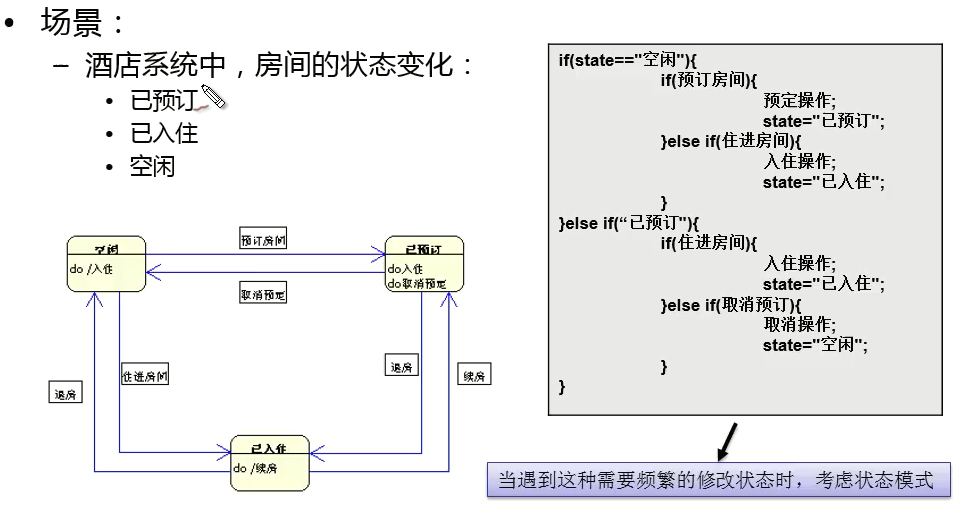
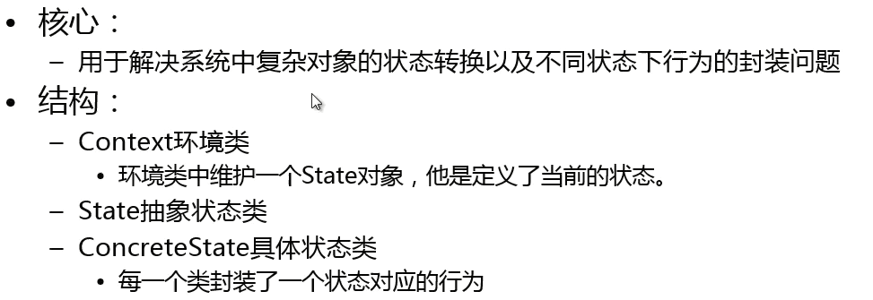
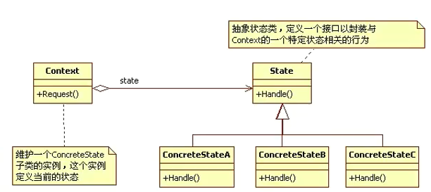
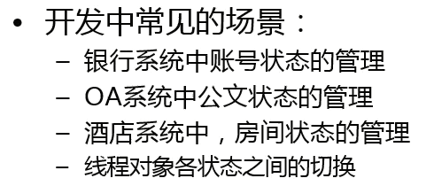

### 状态模式

#### 案例

#### 结构

#### UML

#### 场景

#### 与状态模式的比较

- 状态模式的类图和策略模式类似，并且都是能够动态改变对象的行为。但是状态模式是通过状态转移来改变 Context 所组合的 State 对象，而策略模式是通过 Context 本身的决策来改变组合的 Strategy 对象。所谓的状态转移，是指 Context 在运行过程中由于一些条件发生改变而使得 State 对象发生改变，注意必须要是在运行过程中。
     
- 状态模式主要是用来解决状态转移的问题，当状态发生转移了，那么 Context 对象就会改变它的行为；而策略模式主要是用来封装一组可以互相替代的算法族，并且可以根据需要动态地去替换 Context 使用的算法。